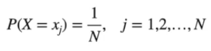
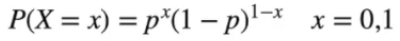
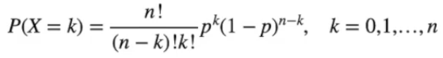
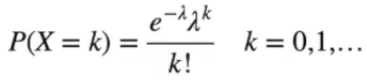

# Modelos Discretos

Em muitos casos, podemos escrever a função de probabilidade de uma forma compacta.

## Modelo Uniforme Discreto

Seja X uma variável aleatória com valores x1, x2, x3, ..., xn. Dizemos que X segue 
o modelo discreto uniforme se cada valor possui a mesma probabilidade de ocorrer.

  

## Modelo de Bernoulli

Dizemos que uma variável aleatória discreta segue o modelo de Bernoulli se:

  

Sendo a esperança e a variância iguais à:

E(X) = p,  
V(X) = p(1-p)

## Modelo de Distribuição Binomial

Seja uma variável aleatória baseada em n repetições de um processo de Bernoulli, então:

  

Sendo a esperança e a variância iguais à:

E(X) = np,  
V(X) = np(1-p)

## Distribuição de Poisson

Uma variável aleatória tem distribuição de Poisson com parâmetro  λ > 0 (taxa) se sua função de probabilidade é dada por:

  

Sendo a esperança e a variância iguais à:

E(X) = λ,  
V(X) = λ

## Distribuição Geométrica

## Distribuição Binomial Negativa

## Distribuição Hipergeométrica