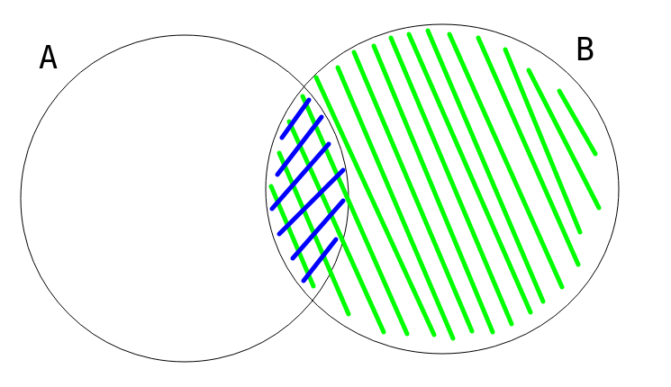
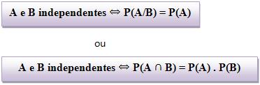

# Anotações sobre a Aula 2 - Probabilidade Condicional

## Probabilidade Condicional

### Dependência

Eventos podem se influenciar. Dado um evento B ocorreu, qual a chance de ocorrencia de um evento A?

Esta relação é definida por:

 

Com P(B) > 0.

De forma mais visual, podemos ver que:

 

### Independência

A e B são eventos independentes se, e somente se, 

  

 &nbsp &nbsp  &nbsp Provar que é verdade! 

  

