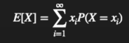
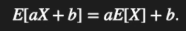
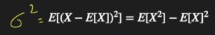

# Esperança e variância de uma variável aleatória

**Definição:** Uma variável aleatória X **é uma função** que associa a todo evento, em um espaço amostral Ω, um ńico número real.  
  
Obs. pessoal: Na matemática, é interessante entender as coisas pelas definições, e não pelo que o nome ou nossas ideias intuitivas de determinada coisa podem nos levar a creer. Se um termo com a palavra "variável" está definido como "função", então é uma função.

**Definição de Variável Aleatória Discreta:** X é uma variável aleatória discreta se assume valores em conjunto enumerável com certa probabilidade P(X=xᵢ), i = 1, 2, ..., onde 0 ≤ P(X = xᵢ) ≤ 1, ∀i.  
  
**Definição de Variável Aleatória Contínua:** X é uma variável aleatória contínua se assume valores no conjunto dos reais e tem associada uma função densidade de probabilidade f(x).  
A probabilidade do evento X ∈ [a, b], a, b ∈ R, é calculada por:  

 

Notem que P(X = x) = 0 para qualquer x ∈ R.  
  
## Valor esperado

  

**Propriedade**

  

## Variância

  

Obs.: Esperança e variância serão melhor estudados nas aulas 8, 9 e 10.
