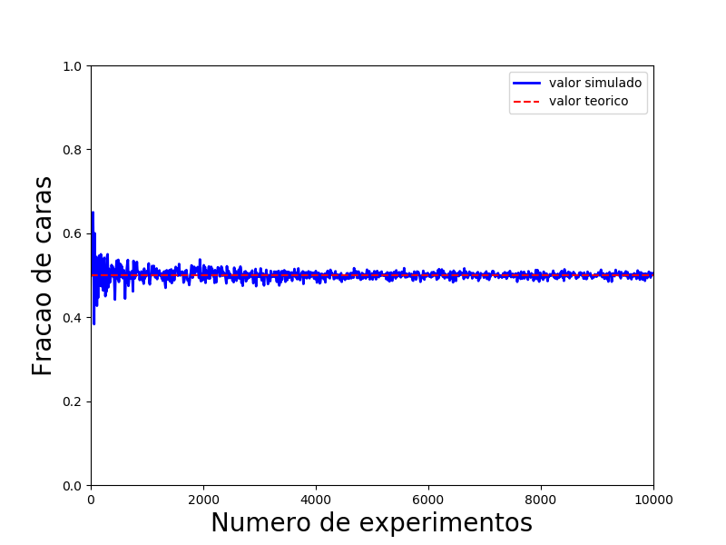

# Programas

Alguns programas foram criados para melhor compreensão do conteúdo do curso.

## 1. Primeiro experimento computacional de eventos ~~pseudo~~aleatórios

Execute o programa MoedaAleariatoria através do comando:  

` python3 MoedaAleatoria.py `

Neste programa, você irá digitar o número de vezes em que uma moeda será jogada, receberá o resultado das jogadas e a porcentagem de vezes em que o lado "cara" apareceu.

Este programa é uma adaptação do mostrado na Aula 1, e serve para aplicar a Lei dos Grandes Números de Bernoulli. É possível perceber que, quanto maior o número de jogadas, mais a frequência obtida é próxima do valor esperado, no caso, 0,5.

Executanto o programa MoedaAleatoriaGrafico, é possível ver um gráfico que relaciona a frequencia de caras com o número de jogadas em n simulações, sendo n um número inserido pelo usuário. Veja um exemplo com n = 1000:

Observando o gráfico, fica ainda mais evidente que, quanto maior o número de jogadas, mais a frequencia tende ao valor esperado.

Para executar este programa, certifique-se de ter o pacote python3-matplotlib instalado e utilize o comando:

` python3 MoedaAleatoriaGrafico.py `
