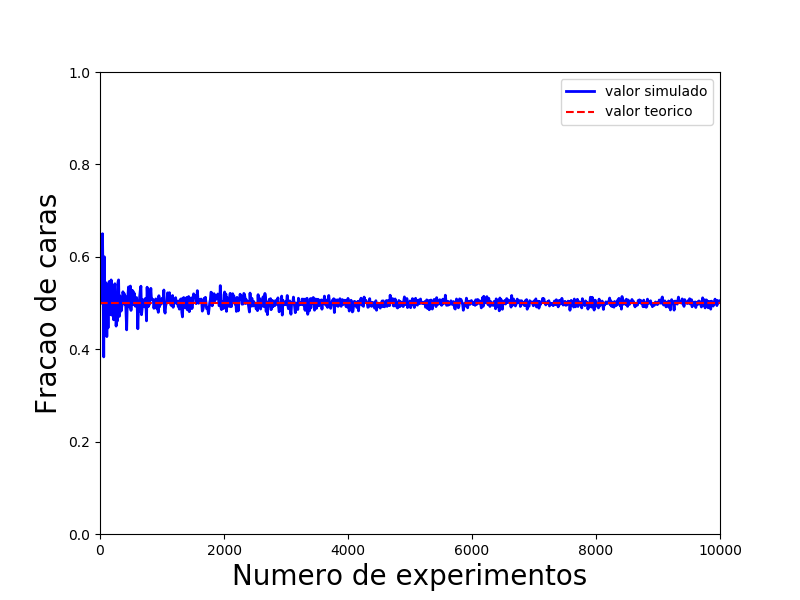
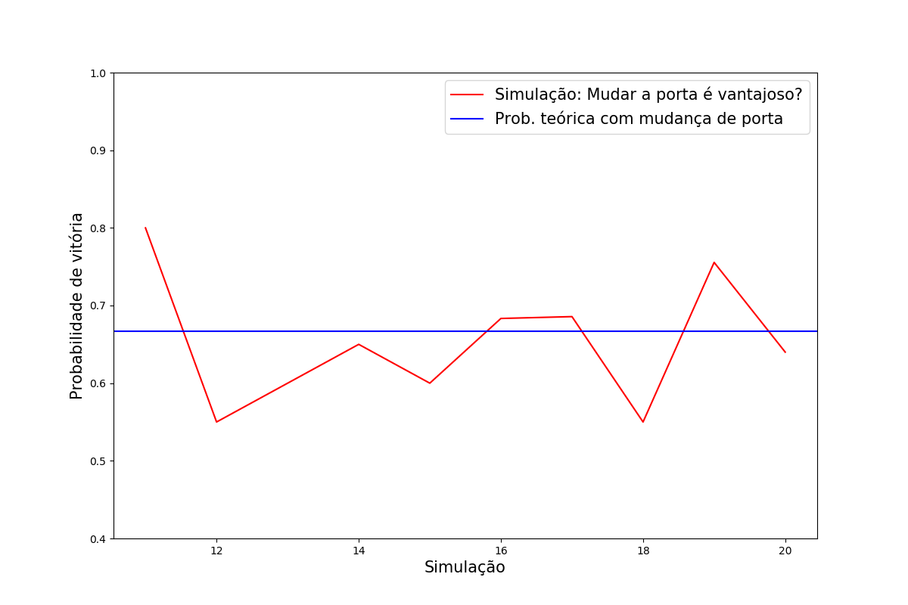
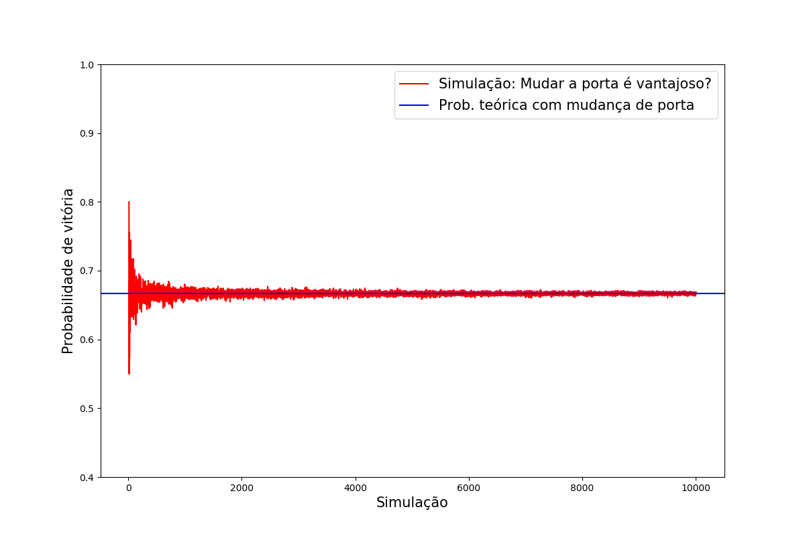

# Programas

Alguns programas foram criados para melhor compreensão do conteúdo do curso.

## 1. Primeiro experimento computacional de eventos ~~pseudo~~aleatórios

Execute o programa MoedaAleariatoria através do comando:  

` python3 MoedaAleatoria.py `

Neste programa, você irá digitar o número de vezes em que uma moeda será jogada, receberá o resultado das jogadas e a porcentagem de vezes em que o lado "cara" apareceu.

Este programa é uma adaptação do mostrado na Aula 1, e serve para aplicar a Lei dos Grandes Números de Bernoulli. É possível perceber que, quanto maior o número de jogadas, mais a frequência obtida é próxima do valor esperado, no caso, 0,5.

Executanto o programa MoedaAleatoriaGrafico, é possível ver um gráfico que relaciona a frequencia de caras com o número de jogadas em n simulações, sendo n um número inserido pelo usuário. Veja um exemplo com n = 1000:

Observando o gráfico, fica ainda mais evidente que, quanto maior o número de jogadas, mais a frequencia tende ao valor esperado.

Para executar este programa, certifique-se de ter o pacote python3-matplotlib instalado e utilize o comando:

` python3 MoedaAleatoriaGrafico.py `

## 2. Monty Hall

Execute o programa MontyHall.py através do comando:

` python3 MontyHall.py `

Neste programa, você irá digitar o número de testes do calculo da probabilidade frequentista do [Problema de Monty Hall](https://pt.wikipedia.org/wiki/Problema_de_Monty_Hall). Para cada teste, o número de simulação aumenta em 10. Por exemplo: No caso em que haja 10 testes, o primeiro teste simula o problema 10 vezes e calcula a probabilidade frequentista de vitória, ou seja, o número de vezes em que trocar de porta foi vantajoso dividido por 10. No próximo teste, o problema será simulado 20 vezes e assim por diante, até o teste 10, com 100 simulações.

Compare o gráfico para 10 testes e para 10.000 testes. Novamente é possível observar a Lei dos Grandes Números, onde quanto maior o número de simulações, mais a probabilidade observada se aproxima do valor teórico.

**10 testes**

  

**10.000 testes**

  

